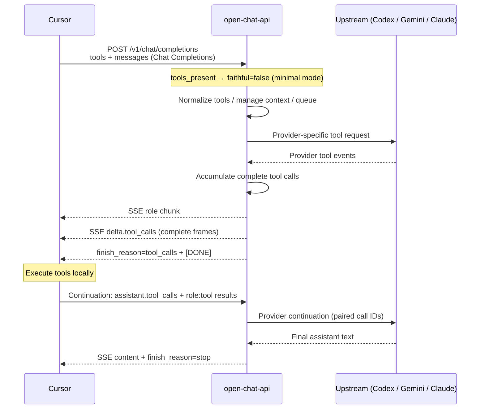

# Cursor tool conventions

Cursor Agent talks to BYOK backends using the **OpenAI Chat Completions tools protocol** — the same surface OpenRouter (and other OpenAI-compatible gateways) expose. This service is not a thin pass-through: each upstream (Codex Responses websocket, Gemini/Antigravity, Claude Code CLI) speaks a different tool dialect, so the API **normalizes inbound Cursor tools**, **adapts them per provider**, and **re-emits Cursor-safe `delta.tool_calls` SSE**.

This page is the contract + implementation map. Source of truth for behavior is the Go code cited below; keep this doc aligned when the wire format changes.

## Goals (what “like OpenRouter” means here)

| Goal | Contract |
| --- | --- |
| Cursor can discover/complete with tools | Accept Chat Completions `tools` / `tool_choice` / `parallel_tool_calls` |
| Cursor can run Agent loops | Stream `delta.tool_calls`, finish with `finish_reason:"tool_calls"`, accept `role:"tool"` continuations |
| Upstream credentials stay CLI/OAuth | No OpenAI `sk-`; tools still execute **inside Cursor**, not in this proxy |
| Stable multi-turn IDs | Pair assistant `tool_calls[].id` with `tool_call_id` across turns (with Codex 64-char hashing) |
| Custom/freeform tools still work in BYOK | Default `CODEX_CUSTOM_TOOL_WIRE=function` so Cursor’s parser does not drop `type:"custom"` |

Non-goals:

- Implementing `/v1/responses` (Cursor may probe it; this service does not).
- Running Cursor’s local tools server-side.
- Request-level round-robin of tool turns across Codex shards (affinity is sticky per chat).

## End-to-end Agent loop



## Inbound contract (Cursor → API)

### Request fields

`POST /v1/chat/completions` body (relevant fields):

| Field | Cursor Agent expectation | API behavior |
| --- | --- | --- |
| `tools` | Nested Chat Completions shape | Accepted; classified as `nested` / `flat` / `mixed` for diagnostics |
| `tool_choice` | `"auto"` / `"none"` / `"required"` or forced function object | Passed / flattened per provider |
| `parallel_tool_calls` | Often `true` | Logged; honored where upstream allows |
| `messages[]` | Includes `assistant.tool_calls` and `role:"tool"` | Translated into provider history |
| `stream` | Usually `true` for Agent | Streaming uses Cursor-safe accumulator (below) |

Nested tool (what Cursor sends):

```json
{
  "type": "function",
  "function": {
    "name": "read_file",
    "description": "...",
    "parameters": { "type": "object", "properties": { "path": { "type": "string" } } }
  }
}
```

Custom / freeform tool (also accepted):

```json
{
  "type": "custom",
  "custom": {
    "name": "apply_patch",
    "description": "...",
    "parameters": { "type": "object", "properties": { "input": { "type": "string" } } }
  }
}
```

Wire classification lives in [`internal/server/cursor_wire.go`](https://github.com/teslashibe/open-chat-api/blob/main/internal/server/cursor_wire.go) (`tool_wire=nested|flat|mixed|none`).

### Faithful vs minimal mode

When the client sends `tools` (Cursor Agent always does):

- Default: `faithful=false`, `prewarm=false` — **minimal mode**.
- Faithful Codex mode injects the captured CLI profile/tools and conflicts with client tool definitions; it is **disabled automatically** unless the client forces `"faithful": true`.

See [`internal/server/server.go`](https://github.com/teslashibe/open-chat-api/blob/main/internal/server/server.go) (`toolsPresent` → `faithful := defaultBool(req.Faithful, !toolsPresent)`).

Tool-capable requests also enter the agent queue (`CODEX_AGENT_QUEUE_KEY_MODE=cursor` by default) and optional context compaction for long histories.

### Continuation messages

After Cursor executes tools, the next request must include:

1. Prior assistant message with `tool_calls` (same `id`s Cursor received).
2. One `role:"tool"` message per result with matching `tool_call_id` and string/structured `content`.

Example skeleton:

```json
{
  "model": "gpt-5.6-terra",
  "stream": true,
  "tools": [{ "type": "function", "function": { "name": "read_file", "parameters": { "type": "object" } } }],
  "messages": [
    { "role": "user", "content": "Read go.mod" },
    {
      "role": "assistant",
      "content": null,
      "tool_calls": [
        {
          "id": "call_123",
          "type": "function",
          "function": { "name": "read_file", "arguments": "{\"path\":\"go.mod\"}" }
        }
      ]
    },
    { "role": "tool", "tool_call_id": "call_123", "content": "module github.com/teslashibe/open-chat-api\n..." }
  ]
}
```

Turn classification (`tool_generating`, `tool_result_continuation`, `final_prose_continuation`, `simple_no_tool`) drives queue priority experiments — see `internal/server/turn_classification.go`.

## Outbound contract (API → Cursor)

### Streaming shape (Cursor-safe)

Cursor’s BYOK Chat Completions parser is strict. This API does **not** forward upstream argument fragments as many tiny OpenAI tool deltas. Instead:

1. Emit one role chunk: `delta.role = "assistant"`.
2. Accumulate each tool call to completion (name + full arguments / custom input).
3. Emit **one complete** `delta.tool_calls` frame per tool call.
4. Emit `finish_reason: "tool_calls"`.
5. Terminate with `data: [DONE]`.

Each emitted tool-call delta must be Cursor-safe:

| Field | Requirement |
| --- | --- |
| `index` | Stable OpenAI index (first-seen order) |
| `id` | Non-empty (upstream `call_id` or deterministic fallback `call_<stream>_<index>`) |
| `type` | `"function"` by default for BYOK (see custom wire below) |
| `function.name` | Non-empty |
| `function.arguments` | Complete string; for `function` type must be **valid JSON** (default `"{}"`) |

Empty tool-call deltas are dropped. Invalid accumulated function JSON fails the stream with an error chunk instead of a fake `tool_calls` finish.

Tests encode this contract as `assertExactCursorToolSSE` in [`internal/server/server_test.go`](https://github.com/teslashibe/open-chat-api/blob/main/internal/server/server_test.go). Implementation: [`internal/server/stream_processor.go`](https://github.com/teslashibe/open-chat-api/blob/main/internal/server/stream_processor.go).

Example streaming frames (conceptual):

```text
data: {"id":"chatcmpl-...","object":"chat.completion.chunk","choices":[{"index":0,"delta":{"role":"assistant"}}]}

data: {"id":"chatcmpl-...","object":"chat.completion.chunk","choices":[{"index":0,"delta":{"tool_calls":[{"index":0,"id":"call_123","type":"function","function":{"name":"read_file","arguments":"{\"path\":\"go.mod\"}"}}]}}]}

data: {"id":"chatcmpl-...","object":"chat.completion.chunk","choices":[{"index":0,"delta":{},"finish_reason":"tool_calls"}]}

data: [DONE]
```

### Non-streaming shape

`choices[0].message.tool_calls[]` populated; `finish_reason` is `"tool_calls"`. Same custom→function downgrade applies via `openAIToolCalls` in `server.go`.

### Custom tool wire (`CODEX_CUSTOM_TOOL_WIRE`)

Codex/Gemini can produce **custom** (freeform text) tool calls (`apply_patch`-style). Cursor BYOK’s chat-completions parser **drops `type:"custom"`**.

| Env value | Emitted wire |
| --- | --- |
| `function` (default, compose default) | Downgrade: `type:"function"`, freeform text in `function.arguments` |
| `custom` | Preserve: `type:"custom"`, `custom.name` + `custom.input` |

Compose sets `CODEX_CUSTOM_TOOL_WIRE=function` so Cursor Agent works without client changes.

## Provider adaptations

### Codex / ChatGPT (Responses API)

**Inbound tools:** Chat Completions nested tools → flat Responses tools:

```text
{"type":"function","function":{"name":"X","parameters":{...}}}
  → {"type":"function","name":"X","parameters":{...}}
```

Implemented by `normalizeToolsForCodex` / `normalizeToolChoiceForCodex` in [`internal/codex/builder.go`](https://github.com/teslashibe/open-chat-api/blob/main/internal/codex/builder.go). Already-flat tools pass through.

**History:**

- Assistant `tool_calls` → Responses `function_call` items (`call_id`, `name`, `arguments`).
- `role:"tool"` → `function_call_output` items paired by `call_id`.

**`call_id` limit:** Codex enforces **≤ 64 characters**. Cursor can emit longer IDs; `normalizeCallID` SHA-256-hexes overlong IDs deterministically so the assistant call and tool output stay paired.

**Upstream events → internal deltas:** See [`docs/codex-tool-events.md`](https://github.com/teslashibe/open-chat-api/blob/main/docs/codex-tool-events.md) and [`internal/codex/events.go`](https://github.com/teslashibe/open-chat-api/blob/main/internal/codex/events.go):

- `response.output_item.added` (`function_call` / `custom_tool_call`)
- `response.function_call_arguments.delta` / `.done`
- `response.custom_tool_call_input.delta` / `.done`
- Compatibility aliases (`response.tool_call.*`, etc.)

Those become internal `StreamEvent.ToolCallDelta` values; the stream processor then emits Cursor-safe OpenAI frames.

### Gemini / Antigravity

**Inbound tools:** Nested `function` / `custom` / flat tools → Gemini `functionDeclarations` ([`internal/gemini/builder.go`](https://github.com/teslashibe/open-chat-api/blob/main/internal/gemini/builder.go)).

- JSON Schema keywords Gemini rejects are stripped (`$schema`, `additionalProperties`, `$defs`, …).
- Custom tools get an `input: string` schema fallback when parameters are empty.
- Names marked `type:"custom"` are tracked; streamed Gemini function calls for those names are re-tagged `custom` and arguments unwrapped via `{"input":"..."}` when present ([`internal/gemini/events.go`](https://github.com/teslashibe/open-chat-api/blob/main/internal/gemini/events.go)).

**Outbound:** Same Cursor SSE accumulator / custom-wire downgrade as Codex.

### Claude Code CLI

Claude Code does not natively speak Cursor’s Chat Completions tool protocol. The API injects a **prompt-level Cursor tool protocol** and parses model output back into OpenAI tool calls.

**Injected instructions** ([`internal/claude/tools.go`](https://github.com/teslashibe/open-chat-api/blob/main/internal/claude/tools.go)):

- Cursor (not Claude Code) executes tools.
- Model must emit a fenced block and no other text when it needs workspace state:

````text
```cursor_tool_call
{"name":"tool_name","arguments":{}}
```
````

- For custom tools, use `"input"` (freeform) instead of `"arguments"`.
- Available tools are listed as JSON after the instructions.

**Bridge** ([`internal/claude/tool_bridge.go`](https://github.com/teslashibe/open-chat-api/blob/main/internal/claude/tool_bridge.go)):

- Scans content **and** reasoning streams so fences never leak as prose.
- Supports multiple tool calls per turn (incrementing index).
- Tolerates unfenced bare JSON lines **only if** the `name` is a registered tool.
- Emits internal `ToolCallDelta` with deterministic `call_claude_<hash>` IDs, then the shared stream processor emits Cursor-safe SSE.

When `GATEWAY_PROVIDERS` omits `claude`, this entire surface is disabled.

## OpenAI type contracts (Go)

Defined in [`internal/openai/openai.go`](https://github.com/teslashibe/open-chat-api/blob/main/internal/openai/openai.go):

| Type | Role |
| --- | --- |
| `ChatCompletionRequest.Tools` / `ToolChoice` / `ParallelToolCalls` | Inbound Cursor fields |
| `ChatMessage.ToolCalls` / `ToolCallID` | History + continuation |
| `ToolCall` / `ToolCallCustom` / `ToolCallFunction` | Non-stream assistant tool calls |
| `ToolCallDelta` / `ToolCallFunctionDelta` | Streaming `delta.tool_calls` |
| `ChatDelta.ReasoningContent` | Optional reasoning channel (kept separate from tool frames) |

Internal provider events use `codex.ToolCallDelta` / `codex.ToolCall` as the common intermediate representation before OpenAI encoding.

## Configuration knobs

| Setting | Default | Effect on Cursor tools |
| --- | --- | --- |
| `CODEX_CUSTOM_TOOL_WIRE` | `function` | Downgrade custom → function for BYOK |
| `CODEX_AGENT_QUEUE_*` | queue on, per-key=1 | Serialize overlapping Agent turns per chat |
| `CODEX_CONTEXT_MANAGEMENT_*` | enabled | Compact long tool histories without breaking call/result pairs |
| `CODEX_LOG_BODY_SHAPE` | compose often `true` | Redacted tool counts / emit diagnostics |
| `CODEX_LOG_CODEX_TOOL_EVENTS` | `false` | Per-fragment Codex tool event shapes (no arg contents) |
| `GATEWAY_PROVIDERS` | `codex,gemini,claude` | Which surfaces can serve tool turns |

## Validation checklist

1. Start API + tunnel ([BYOK + ngrok](./byok-ngrok)).
2. New Cursor Agent chat: `List the files in this repo.`
3. Server logs show `tools_present=true`, queue acquire/release, and (with body-shape logging) `tool_call_emit` / `response_tool_calls=true`.
4. Stream capture (optional mitm via `tools/cursor_header_capture.py`) should show:
   - `tool_frames=<n>`, `empty_tool_frames=0`
   - `finish=tool_calls`, `done=True`
   - `tool_ids_present=True`, `tool_names_present=True`, `tool_args_json_valid=True`
5. Continuations: several tool rounds in the same chat without Cursor falling back to another provider.
6. Unit/integration: `go test ./internal/server ./internal/codex ./internal/claude ./internal/gemini`.

Deeper Codex event notes: [`docs/codex-tool-events.md`](https://github.com/teslashibe/open-chat-api/blob/main/docs/codex-tool-events.md).

## Implementation map

| Concern | Primary files |
| --- | --- |
| Request wire summary | `internal/server/cursor_wire.go` |
| Faithful/minimal + routing | `internal/server/server.go` |
| Cursor-safe SSE accumulation | `internal/server/stream_processor.go` |
| OpenAI JSON contracts | `internal/openai/openai.go` |
| Codex tool normalize + call_id | `internal/codex/builder.go` |
| Codex WS event parse | `internal/codex/events.go` |
| Gemini tools / custom names | `internal/gemini/builder.go`, `events.go` |
| Claude fence protocol | `internal/claude/tools.go`, `tool_bridge.go` |
| Contract tests | `internal/server/server_test.go` (`assertExactCursorToolSSE`) |

## Modifying the API safely

When changing tool behavior:

1. **Preserve the Cursor SSE contract** — one complete tool frame per call; never emit empty `delta.tool_calls`; keep `finish_reason:"tool_calls"` before `[DONE]`.
2. **Keep custom→function default** unless you are targeting a client that understands `type:"custom"`.
3. **Pair call IDs** across assistant → tool → upstream (`normalizeCallID` for Codex).
4. **Do not re-enable faithful Codex tools** for Cursor Agent requests that already send `tools`.
5. **Update tests** in `assertExactCursorToolSSE` / provider builder tests, and this page + `docs/codex-tool-events.md` if event shapes change.
6. **Never log** tool arguments, schemas, or prompt text in production logs — redacted field names/counts only.
