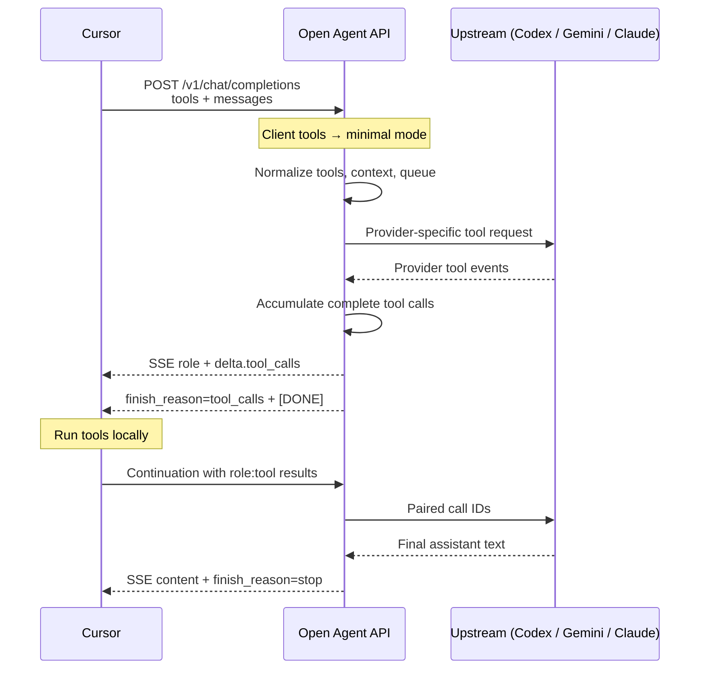

# Cursor Agent tool calling

**Short answer:** Cursor Agent talks to custom OpenAI endpoints using Chat Completions **tools** — the same shape OpenRouter and other OpenAI-compatible APIs use. Open Agent API accepts that wire format, translates it for Codex / Claude Code / Antigravity, then streams Cursor-safe `delta.tool_calls` so Agent mode can run tools locally and continue the chat.

Tools still run **inside Cursor** (read file, shell, etc.). This service never executes your workspace tools; it only carries the protocol.

Use this page when you need the exact request/response contracts or when changing the adapters in Go.

## What Cursor needs from a BYOK endpoint

Cursor Agent only works against a backend that:

1. Accepts `tools`, `tool_choice`, and `parallel_tool_calls` on `POST /v1/chat/completions`
2. Streams complete `delta.tool_calls` frames and ends with `finish_reason: "tool_calls"`
3. Accepts follow-ups with `assistant.tool_calls` plus matching `role: "tool"` results
4. Keeps tool-call IDs stable across turns
5. Speaks `type: "function"` tool calls by default (Cursor’s BYOK parser drops `type: "custom"`)

Open Agent API does that while authenticating upstream with local CLI/OAuth — not OpenAI `sk-` keys.

**Out of scope**

- `/v1/responses` (Cursor may probe it; we don’t implement it)
- Running Cursor’s tools on the server
- Spreading one chat’s tool turns across random Codex shards (routing is sticky per chat)

## How an Agent turn flows



## Requests from Cursor

### Fields that matter

| Field | What Cursor sends | What we do |
| --- | --- | --- |
| `tools` | Nested Chat Completions functions | Accept; log as nested / flat / mixed |
| `tool_choice` | `auto` / `none` / `required` or a forced function | Pass through / flatten per provider |
| `parallel_tool_calls` | Often `true` | Honor when the upstream allows |
| `messages` | Prior `tool_calls` + `role: "tool"` | Map into provider history |
| `stream` | Usually `true` in Agent | Use the Cursor-safe SSE accumulator |

Typical nested tool from Cursor:

```json
{
  "type": "function",
  "function": {
    "name": "read_file",
    "description": "...",
    "parameters": { "type": "object", "properties": { "path": { "type": "string" } } }
  }
}
```

Custom / freeform tools are also accepted:

```json
{
  "type": "custom",
  "custom": {
    "name": "apply_patch",
    "description": "...",
    "parameters": { "type": "object", "properties": { "input": { "type": "string" } } }
  }
}
```

Wire sniffing lives in [`internal/server/cursor_wire.go`](https://github.com/teslashibe/open-agent-api/blob/main/internal/server/cursor_wire.go).

### Why “faithful” Codex mode turns off

When the client sends `tools` (Agent always does), we default to **minimal mode** (`faithful=false`). Faithful mode injects the captured Codex CLI tool profile, which clashes with Cursor’s own tools and tends to fail upstream. You can force `"faithful": true` in the JSON body, but Agent shouldn’t.

Tool-capable requests also go through the agent queue (`CODEX_AGENT_QUEUE_KEY_MODE=cursor` by default) and optional context compaction on long histories.

### Continuations after a tool runs

After Cursor executes tools, the next request must include:

1. The prior assistant message with the same `tool_calls` IDs
2. One `role: "tool"` message per result, with matching `tool_call_id`

```json
{
  "model": "gpt-5.6-terra",
  "stream": true,
  "tools": [{ "type": "function", "function": { "name": "read_file", "parameters": { "type": "object" } } }],
  "messages": [
    { "role": "user", "content": "Read go.mod" },
    {
      "role": "assistant",
      "content": null,
      "tool_calls": [
        {
          "id": "call_123",
          "type": "function",
          "function": { "name": "read_file", "arguments": "{\"path\":\"go.mod\"}" }
        }
      ]
    },
    { "role": "tool", "tool_call_id": "call_123", "content": "module github.com/teslashibe/open-agent-api\n..." }
  ]
}
```

## Responses Cursor can parse

### Streaming (the important path)

Cursor’s BYOK parser is picky. We don’t forward every upstream argument fragment as a tiny OpenAI delta. We:

1. Emit `delta.role = "assistant"`
2. Accumulate each tool call until name + arguments are complete
3. Emit **one** full `delta.tool_calls` frame per call
4. Emit `finish_reason: "tool_calls"`
5. End with `data: [DONE]`

Each tool-call delta must include:

| Field | Rule |
| --- | --- |
| `index` | Stable, first-seen order |
| `id` | Non-empty |
| `type` | `"function"` by default for BYOK |
| `function.name` | Non-empty |
| `function.arguments` | Full string; valid JSON for function tools (default `"{}"`) |

Empty tool deltas are dropped. Bad JSON arguments become an error chunk, not a fake `tool_calls` finish.

Implemented in [`internal/server/stream_processor.go`](https://github.com/teslashibe/open-agent-api/blob/main/internal/server/stream_processor.go); locked in by `assertExactCursorToolSSE` in the server tests.

### Custom tools and `CODEX_CUSTOM_TOOL_WIRE`

Some upstreams emit freeform **custom** tool calls (for example `apply_patch`). Cursor BYOK drops `type: "custom"`, so the default is to rewrite them as functions:

| `CODEX_CUSTOM_TOOL_WIRE` | Wire to Cursor |
| --- | --- |
| `function` (default) | `type: "function"`, freeform text in `function.arguments` |
| `custom` | Keep `type: "custom"` with `custom.name` / `custom.input` |

## How each upstream is adapted

### Codex / ChatGPT

Chat Completions nested tools become flat Responses tools:

```text
{"type":"function","function":{"name":"X","parameters":{...}}}
  → {"type":"function","name":"X","parameters":{...}}
```

History maps `tool_calls` → `function_call` and `role: "tool"` → `function_call_output`. Codex caps `call_id` at **64 characters**; longer Cursor IDs are hashed so the pair still matches. Event shapes: [`docs/codex-tool-events.md`](https://github.com/teslashibe/open-agent-api/blob/main/docs/codex-tool-events.md).

### Gemini / Antigravity

Tools become Gemini `functionDeclarations`. Rejected JSON Schema keywords are stripped; custom tools get an `input: string` fallback when needed. Same Cursor-facing SSE rules on the way out.

### Claude Code

Claude Code doesn’t speak Chat Completions tools natively. We inject a small **Cursor tool protocol** into the prompt and parse fenced blocks back into OpenAI tool calls:

````text
```cursor_tool_call
{"name":"tool_name","arguments":{}}
```
````

The bridge scans content and reasoning so those fences never leak as chat text. Disabled entirely when `GATEWAY_PROVIDERS` omits `claude`.

## Config that affects Agent tools

| Setting | Default | Effect |
| --- | --- | --- |
| `CODEX_CUSTOM_TOOL_WIRE` | `function` | Keep Cursor’s parser happy with custom tools |
| `CODEX_AGENT_QUEUE_*` | on, per-key `1` | One active Agent stream per chat |
| `CODEX_CONTEXT_MANAGEMENT_*` | enabled | Compact long tool histories without breaking pairs |
| `GATEWAY_PROVIDERS` | `codex,gemini,claude` | Which surfaces serve tool turns |

## How to verify it works

1. Start the API with ngrok ([BYOK setup](./byok-ngrok)) — not localhost.
2. New Agent chat: `List the files in this repo.`
3. Logs should show `tools_present=true` and queue acquire/release.
4. Several tool rounds in the same chat should keep going without Cursor switching providers.
5. `go test ./internal/server ./internal/codex ./internal/claude ./internal/gemini`

## Code map

| Area | Files |
| --- | --- |
| Request wire | `internal/server/cursor_wire.go` |
| Minimal mode + routing | `internal/server/server.go` |
| Cursor-safe SSE | `internal/server/stream_processor.go` |
| OpenAI types | `internal/openai/openai.go` |
| Codex normalize + call IDs | `internal/codex/builder.go`, `events.go` |
| Gemini tools | `internal/gemini/builder.go`, `events.go` |
| Claude fence bridge | `internal/claude/tools.go`, `tool_bridge.go` |
| Contract tests | `internal/server/server_test.go` |

## Changing this safely

Keep the Cursor SSE contract (one complete tool frame, no empty `delta.tool_calls`, `finish_reason: "tool_calls"` before `[DONE]`). Leave the custom→function default unless your client understands `type: "custom"`. Pair call IDs across turns. Don’t re-enable faithful Codex tools for Agent requests that already send `tools`. Update tests and this page when wire shapes change — and never log tool arguments or prompt text.
